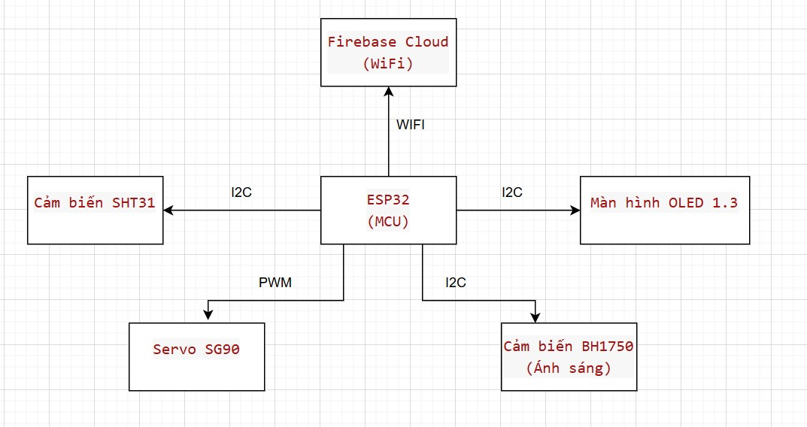
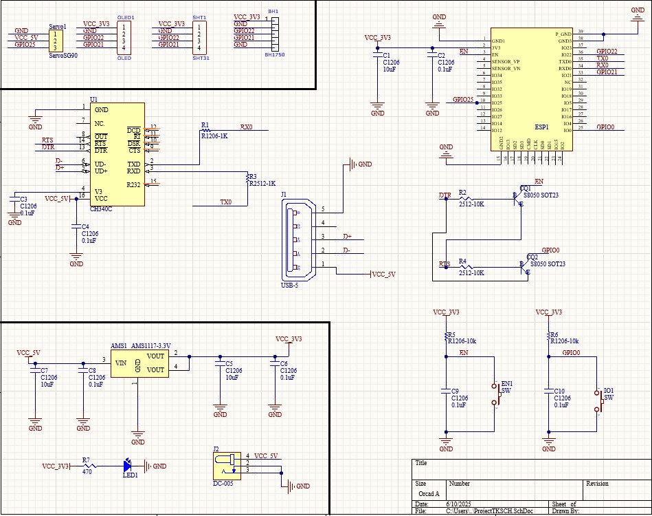

# ESP32 IoT Environmental Monitoring System

A low-cost IoT system for real-time environmental monitoring and device control using ESP32, Firebase, and a Web interface.

---

## 1. Giới thiệu (Introduction)
Dự án tập trung vào việc phát triển một hệ thống giám sát môi trường tích hợp, sử dụng vi điều khiển ESP32 cùng các cảm biến phổ biến. Hệ thống được thiết kế hướng tới tiêu chí chi phí thấp, dễ triển khai và có khả năng mở rộng, phù hợp cho các hộ gia đình hoặc trang trại quy mô nhỏ.

## 2. Thành phần hệ thống (System Components)

### Phần cứng (Hardware):
* **Vi điều khiển chính**: ESP32 (Tích hợp WiFi/Bluetooth, xung nhịp lên đến 240 MHz).
* **Cảm biến ánh sáng**: BH1750 (Giao tiếp I2C, đo cường độ ánh sáng Lux).
* **Cảm biến nhiệt độ & độ ẩm**: SHT31 (Giao tiếp I2C, độ chính xác cao).
* **Hiển thị**: Màn hình OLED 1.3 inch (Hiển thị thông số thời gian thực).
* **Cơ cấu chấp hành**: Servo SG90 (Mô phỏng điều khiển cửa thông gió, van nước).
* **Khối nguồn**: Adapter 5V 3A, Jack DC-005, IC hạ áp AMS1117-3.3V.

### Công nghệ & Phần mềm (Tech Stack):
* **Môi trường lập trình**: PlatformIO IDE.
* **Ngôn ngữ**: C/C++ (Firmware), HTML/CSS/JavaScript (Web Dashboard).
* **Nền tảng Cloud**: Firebase Realtime Database (Đồng bộ dữ liệu thời gian thực).
* **Giao thức**: I2C (Kết nối đa thiết bị trên 2 dây tín hiệu), PWM (Điều khiển Servo).

## 3. Sơ đồ hệ thống (System Architecture)
Hệ thống sử dụng ESP32 làm bộ xử lý trung tâm, thu thập dữ liệu từ cảm biến qua bus I2C và điều khiển Servo qua tín hiệu PWM.

## 4. Đặc điểm nổi bật (Key Features)
* **Giám sát thời gian thực**: Theo dõi nhiệt độ, độ ẩm và ánh sáng trực tiếp tại thiết bị qua OLED và qua giao diện Web từ xa.
* **Phản hồi tự động & thủ công**: Điều khiển Servo thông qua lệnh từ Internet để thực hiện các thao tác cơ khí.
* **Đồng bộ hóa dữ liệu**: Sử dụng Firebase giúp dữ liệu được cập nhật liên tục và ổn định trên nền tảng đám mây.
* **Thiết kế PCB chuyên nghiệp**: Hệ thống được đóng gói gọn gàng trên mạch in tự thiết kế và bảo vệ trong hộp kỹ thuật.

## 5. Hình ảnh thực tế (Project Showcase)

| Mạch in (PCB) đã hoàn thiện | Sản phẩm đóng gói thực tế |
| :---: | :---: |
|  |  |

## 6. Bài học rút ra (Lessons Learned)
Thông qua dự án cá nhân này, em đã có cơ hội học hỏi và thực hành các kỹ năng:
* Tìm hiểu quy trình lựa chọn linh kiện và thiết kế mạch điện tử dựa trên nhu cầu thực tế.
* Rèn luyện kỹ năng lập trình hệ thống nhúng và xử lý lỗi (debug) phần cứng lẫn phần mềm.
* Hiểu rõ cách triển khai một hệ thống IoT hoàn chỉnh từ thiết bị ngoại vi đến Cloud và người dùng cuối.

---
*Để biết thêm chi tiết về thông số kỹ thuật và hướng dẫn lắp đặt, vui lòng xem [Báo cáo đồ án chi tiết (PDF)](đường_dẫn_đến_file_pdf_trong_thư_mục_docs_của_em)*
